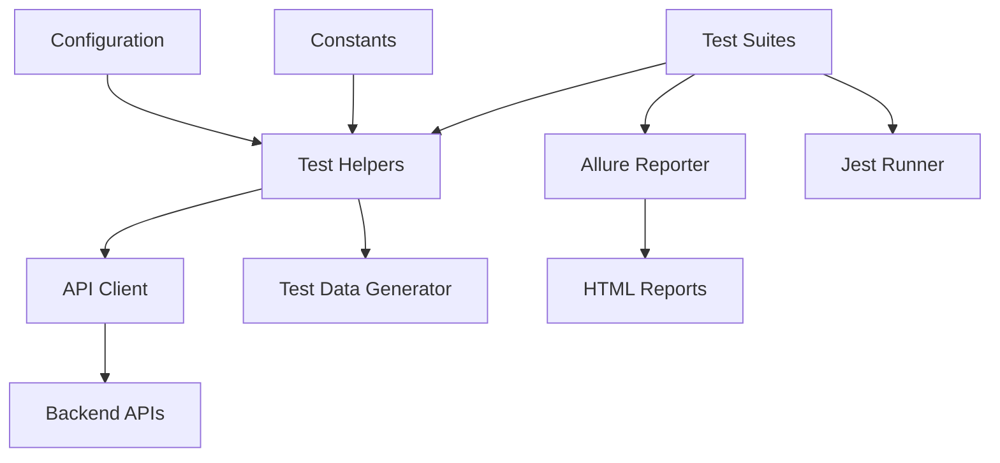

# Jest-Api-testing-project

# 🚀 Enterprise API Testing Framework

A comprehensive, professional-grade automated testing framework for enterprise API validation, security testing, and performance monitoring. Built with Jest, Allure Reporting, and modern testing best practices.


## 📋 Table of Contents

- [🌟 Overview](#-overview)
- [🎯 Key Features](#-key-features)
- [🏗️ Architecture](#️-architecture)
- [⚡ Quick Start](#-quick-start)
- [🔧 Installation](#-installation)
- [🚀 Usage](#-usage)
- [📁 Project Structure](#-project-structure)
- [🧪 Test Types](#-test-types)
- [📊 Reporting](#-reporting)
- [🛠️ Configuration](#️-configuration)
- [🔍 Enhanced Features](#-enhanced-features)
- [🤝 Contributing](#-contributing)
- [📞 Support](#-support)

## 🌟 Overview

This enterprise testing framework provides comprehensive API validation, security testing, and performance monitoring for microservices architectures. It supports automated CRUD lifecycle testing, security vulnerability scanning, performance benchmarking, and health monitoring across all API endpoints.

### 🎯 Key Objectives

- **Comprehensive Coverage**: Test all API endpoints automatically
- **Security First**: Built-in security testing and vulnerability scanning
- **Performance Monitoring**: Track API performance under load
- **Professional Reporting**: Detailed Allure reports with actionable insights
- **CI/CD Ready**: Seamless integration with DevOps pipelines
- **Enterprise Scale**: Support for large, complex API ecosystems

## 🎯 Key Features

### ✅ Comprehensive Testing

- **CRUD Lifecycle Testing**: Complete Create-Read-Update-Delete validation
- **Security Testing**: Authorization, authentication, and input validation
- **Performance Testing**: Load testing and performance benchmarks
- **Health Monitoring**: Endpoint health checks and availability monitoring

### 🛡️ Security Features

- **Malicious Payload Protection**: SQL injection, XSS, path traversal detection
- **Authorization Security**: Token validation and access control testing
- **Input Validation**: Comprehensive data validation and sanitization
- **Security Headers**: Security header validation and compliance checking

### 📊 Advanced Reporting

- **Allure Integration**: Professional test reporting with screenshots
- **Real-time Monitoring**: Live test execution tracking
- **Trend Analysis**: Historical performance and test result analysis
- **Custom Dashboards**: Tailored reporting for different stakeholders

### 🔧 Technical Excellence

- **Modular Architecture**: Scalable and maintainable test structure
- **Configuration Driven**: YAML/JSON based test configuration
- **Environment Aware**: Multi-environment support (dev, staging, prod)
- **Extensible Framework**: Easy to extend with custom test types

## 🏗️ Architecture



## ⚡ Quick Start

### Prerequisites

- Node.js 16+
- npm or yarn
- Java 8+ (for Allure reporting)

### 🔧 Installation

```bash
# Clone the repository
git clone https://github.com/your-org/api-testing-framework.git
cd api-testing-framework

# Install dependencies
npm install

# Install Allure commandline (for reporting)
npm install -g allure-commandline

# Set up environment variables
cp .env.example .env
# Edit .env with your configuration
```

### 🚀 Running Tests

### Clean and run tests

```bash
npm run clean:reports
```

### Generate Authorization Token

```bash
$TOKEN = node fetchToken.js | Select-String -Pattern "TOKEN" | ForEach-Object { $_ -replace 'TOKEN=', '' -replace '"', '' }
```

```bash
$env:TOKEN = $TOKEN
echo $TOKEN
```

# Run all tests with reporting

```bash
npm run test:allure
```

# Run specific test suite

```bash
npm run test:crud
npm run test:security
npm run test:performance
```

# Run with specific environment

```bash
npm run test:staging
npm run test:production
```

# Run with watch mode (development)

```bash
npm run test:watch
```

# Generate Allure reports

```bash
npm run report
```

### Generate Allure Reports
```bash
npm run allure:generate
```

### Verify Allure Report Correctness
```bash
npm run verify:allure
```

### Open the generated Allure Reports
```bash
npm run allure:open
```

## 📁 Project Structure

```
Jest-APi-Testing/
├── 📂 tests/
│   ├── 📂 comprehensive-lifecycle/
│   │   ├── 1.comprehensive-CRUD-Validation.test.js
│   │   ├── 2.comprehensive-API-Security.test.js
│   │   ├── 3.Advanced-Security-Testing.test.js
│   │   └── 4.Performance-Malicious-Load.test.js
│   └── 📂 unit/
├── 📂 utils/
│   ├── test-helpers.js
│   ├── api-client.js
│   ├── logger.js
│   └── allure-reporter.js
├── 📂 config/
│   ├── jest.config.js
│   ├── modules-config.js
│   └── environment.js
├── 📂 test-data/
│   ├── 📂 Input/
│   │   └── Main-Standarized-Backend-Api-Schema.json
│   ├── test-data-generator.js
│   └── 📂 templates/
├── 📂 Constants/
│   └── Constants.js
├── 📂 allure-results/
├── 📂 test-results/
├── package.json
├── jest.setup.js
└── README.md
```

## 🧪 Test Types

### 1. CRUD Lifecycle Testing (`1.comprehensive-CRUD-Validation.test.js`)

Complete end-to-end testing of API operations:

```javascript
// 7-Step CRUD Lifecycle
1. POST - Create new resource
2. VIEW - Verify creation
3. EDIT - Update resource
4. VIEW - Verify edit
5. EDIT VIEW - Get edit content
6. DELETE - Remove resource
7. VIEW - Verify deletion
```

### 2. Security Testing (`2.comprehensive-API-Security.test.js`)

Comprehensive security validation:

```javascript
// Security Test Categories
- Authorization & Authentication
- Malicious Payload Protection
- Input Validation & Sanitization
- SQL Injection Prevention
- XSS Attack Prevention
- Data Integrity Validation
```

### 3. Advanced Security (`3.Advanced-Security-Testing.test.js`)

Enterprise-grade security testing:

- OAuth2/OIDC compliance
- Rate limiting testing
- Security header validation
- API gateway security
- Microservices security

### 4. Performance Testing (`4.Performance-Malicious-Load.test.js`)

Performance and load testing:

- Response time benchmarks
- Concurrent user simulation
- Load testing under attack
- Performance degradation detection

## 📊 Reporting

### Allure Reports

Generate professional test reports:

```bash
# Generate and serve Allure report
npm run report:serve

# Generate report only
npm run report:generate

# Open existing report
allure open allure-report
```

### Report Features

- **Interactive Dashboards**: Filter by test type, module, status
- **Trend Analysis**: Historical test performance
- **Failure Analysis**: Detailed error investigation
- **Environment Info**: Test environment configuration
- **Attachments**: Request/response payloads, screenshots, logs

### Custom Metrics

- **Test Coverage**: API endpoint coverage percentage
- **Security Score**: Security test pass rate
- **Performance Benchmarks**: Response time percentiles
- **Reliability Score**: Test stability over time

## 🛠️ Configuration

### Environment Configuration

```javascript
// .env file
API_BASE_URL=https://api.yourdomain.com
API_TOKEN=your-bearer-token
TEST_ENVIRONMENT=staging
LOG_LEVEL=info

// Environment-specific configs
STAGING_API_URL=https://api-staging.yourdomain.com
PRODUCTION_API_URL=https://api.yourdomain.com
```

### Jest Configuration

```javascript
// jest.config.js
module.exports = {
  testEnvironment: "node",
  setupFilesAfterEnv: ["<rootDir>/jest.setup.js"],
  reporters: [
    "default",
    [
      "jest-allure",
      {
        resultsDir: "allure-results",
      },
    ],
  ],
  testTimeout: 30000,
  // ... advanced configuration
};
```

### Module Configuration

Auto-generated from API schema:

```javascript
// config/modules-config.js
module.exports = {
  "Inventory.Master_Data.Warehouse_definitions": {
    Post: ["/api/warehouse"],
    View: ["/api/warehouse/{id}"],
    EDIT: ["/api/warehouse/{id}"],
    DELETE: ["/api/warehouse/{id}"],
  },
  // ... 70+ modules auto-discovered
};
```

## 🔍 Enhanced Features

### 🎯 Smart Test Discovery

```javascript
// Automatically discovers and tests all endpoints
const testModulesComprehensive = (modules, parentPath = "") => {
  Object.entries(modules).forEach(([moduleName, moduleConfig]) => {
    // Recursive endpoint discovery
    // Automatic test generation
    // Comprehensive coverage validation
  });
};
```

### 🛡️ Advanced Security Testing

```javascript
// Comprehensive security validation
await TestHelpers.testAuthorizationSecurity(moduleConfig);
await TestHelpers.testMaliciousPayloads(moduleConfig);
await TestHelpers.testSQLInjectionProtection(moduleConfig);
await TestHelpers.testXSSProtection(moduleConfig);
```

### 📈 Performance Monitoring

```javascript
// Performance under malicious load
const performanceResults = await TestHelpers.testPerformanceUnderMaliciousLoad(
  moduleConfig,
  moduleName
);
```

### 🔄 CRUD Lifecycle Management

```javascript
// Complete resource lifecycle
const lifecycle = await TestHelpers.testCompleteLifecycle(
  moduleConfig,
  testData,
  moduleName
);
```

## 🚀 Advanced Usage

### Custom Test Development

```javascript
// Creating custom test scenarios
describe("Custom Business Logic Validation", () => {
  test("should validate complex business workflow", async () => {
    await global.allureStep("Complex Workflow Test", async () => {
      // Your custom test logic
      const result = await TestHelpers.executeBusinessWorkflow();
      expect(result.success).toBe(true);
    });
  });
});
```

### Integration with CI/CD

```yaml
# GitHub Actions example
name: API Tests
on: [push, pull_request]
jobs:
  test:
    runs-on: ubuntu-latest
    steps:
      - uses: actions/checkout@v2
      - uses: actions/setup-node@v2
        with:
          node-version: "16"
      - run: npm install
      - run: npm test
      - uses: actions/upload-artifact@v2
        with:
          name: allure-results
          path: allure-results/
```

### Custom Reporters

```javascript
// Custom reporter implementation
class CustomReporter {
  onTestResult(test, testResult, aggregatedResult) {
    // Custom reporting logic
    sendToMonitoringSystem(testResult);
    updateTestDashboard(aggregatedResult);
  }
}
```

## 🎯 Test Tags & Filtering

```javascript
const TEST_TAGS = {
  CRUD: "CRUD",
  POSTTransaction: "POSTTransaction",
  Malicious: "Malicious",
  Mandatory: "Mandatory",
  ComprehensiveSecurity: "ComprehensiveSecurity",
  AdvancedSecurity: "AdvancedSecurity",
  Performance: "Performance",
  HealthChecks: "HealthChecks",
};

// Usage in tests
global.allure.addLabel("tag", TEST_TAGS.CRUD);
global.allure.addLabel("severity", "critical");
```

## 🔧 Troubleshooting

### Common Issues

```bash
# Module not found
❌ Fix: Update modules-config.js with correct module paths

# Authentication failures
❌ Fix: Verify API tokens in .env file

# Timeout issues
❌ Fix: Increase jest.testTimeout in configuration

# Allure report generation
❌ Fix: Ensure Java 8+ is installed and ALLURE_HOME is set
```

### Debug Mode

```bash
# Enable debug logging
DEBUG=api*,test* npm test

# Verbose test output
npm run test:verbose

# Specific test debugging
npm run test:debug -- --testNamePattern="Specific Test"
```

## 🤝 Contributing

We welcome contributions! Please see our [Contributing Guide](CONTRIBUTING.md) for details.

### Development Setup

```bash
# Fork and clone
git clone https://github.com/your-username/api-testing-framework.git

# Create feature branch
git checkout -b feature/amazing-feature

# Make changes and test
npm run test:all

# Commit and push
git commit -m "Add amazing feature"
git push origin feature/amazing-feature

# Create Pull Request
```

### Code Standards

- Follow ESLint configuration
- Write comprehensive tests for new features
- Update documentation for changes
- Maintain backward compatibility

## 📞 Support

### Documentation

- 📚 [Full Documentation](docs/README.md)
- 🎥 [Video Tutorials](docs/tutorials.md)
- ❓ [FAQ](docs/FAQ.md)
- 🐛 [Issue Tracker](https://github.com/your-org/api-testing-framework/issues)

### Community

- 💬 [Discussions](https://github.com/your-org/api-testing-framework/discussions)
- 🐦 [Twitter Updates](https://twitter.com/yourhandle)
- 📧 [Email Support](support@yourorg.com)

### Enterprise Support

- 🏢 [Enterprise Features](docs/enterprise.md)
- 🔧 [Custom Integration](docs/integration.md)
- 🎓 [Training & Workshops](docs/training.md)

## 📄 License

This project is licensed under the Apache-20 License - see the [LICENSE](LICENSE) file for details.

## 🙏 Acknowledgments

- Built with [Jest](https://jestjs.io/) testing framework
- Reports by [Allure](http://allure.qatools.ru/)
- Inspired by enterprise testing best practices
- Community contributors and testers

---

<div align="center">

**⭐ Star this repo if you find it helpful!**

[Report Bug](https://github.com/your-org/api-testing-framework/issues) · [Request Feature](https://github.com/your-org/api-testing-framework/issues)

</div>

## Run the Fixed Tests

### Clean and run tests

```bash
npm run clean:reports
```

### Generate Authorization Token

```bash
$TOKEN = node fetchToken.js | Select-String -Pattern "TOKEN" | ForEach-Object { $_ -replace 'TOKEN=', '' -replace '"', '' }
```

```bash
$env:TOKEN = $TOKEN
echo $TOKEN
```

### Run the Tests

```bash
npm run test:allure
```

### Generate report

```bash
npm run allure:generate
npm run allure:open
```

## Vesion ( 1 ) Key Features:

1. Comprehensive Lifecycle Testing: Tests complete CRUD operations in sequence
2. Automatic Module Discovery: Recursively discovers and tests all modules
3. Robust Error Handling: Continues testing other modules even if one fails
4. Detailed Logging: Comprehensive logging for debugging
5. Retry Mechanism: Automatic retry for transient failures
6. Data Validation: Verifies data integrity throughout the lifecycle
7. Flexible Test Data: Module-specific test data generation
8. Performance Monitoring: Tracks test execution times
9. HTML Reports: Generates detailed test reports
10. Configuration Management: Environment-based configuration

## Vesion ( 2 ) Key Enhancements:

### Comprehensive Security Testing:

1. No token authorization
2. Wrong token authorization
3. Various invalid token formats

## Malicious Payload Protection:

1. Wrong data types
2. Invalid data values (negative, zero, invalid dates)
3. SQL injection attempts
4. XSS payloads
5. Buffer overflow attempts
6. Path traversal attempts

## Validation Testing:

1. Null required fields for POST
2. Null required fields for PUT/EDIT
3. Boundary value testing

## Transaction Testing:

1. Complete commit flow testing
2. Status verification
3. Post-commit validation

## Enhanced Reporting:

1. Detailed security test results
2. Comprehensive test summaries
3. Failure analysis

This enhanced testing framework provides enterprise-grade security, validation, and reliability testing for your entire API ecosystem, ensuring robust protection against common vulnerabilities and edge cases.

## Vesion ( 3 ) Key Enhancements:

These fixes will:

✅ Properly display error messages instead of [object Object]
✅ Handle different HTTP methods correctly
✅ Extract IDs from various response structures
✅ Provide flexible status code checking for security tests
✅ Better API endpoint configuration
✅ Enhanced error formatting and logging

## Vesion ( 4 ) Key Enhancements:

🎯 Key Enhancements Made:
✅ 1. Complete Test Failure on Any Step
All test steps now properly throw errors that bubble up to fail the entire test
Enhanced error handling throughout all test helpers
Proper status detection in afterEach hook

✅ 2. Allure Tagging & Filtering
Added comprehensive tag system: CRUD, POSTTransaction, Malicious, Mandatory, ComprehensiveSecurity, AdvancedSecurity, Performance, HealthChecks
Each test case properly tagged for filtering in Allure reports
Module-specific labels for better organization

✅ 3. Enhanced Response Validation
HTTP Status Validation: Checks for 200-399 status codes
Response Content Validation: Detects status: 400 in response body (case-insensitive, any data type)
Comprehensive validation that fails tests on invalid responses

✅ 4. Comprehensive Module Testing
Advanced Security Testing: Now runs on all modules with endpoints
Performance Testing: Runs on all modules with POST endpoints
Health Checks: Runs on all endpoints across all modules
Recursive module discovery ensures no endpoint is missed

✅ 5. Robust CRUD Lifecycle
Proper ID Management: Enhanced ID extraction from multiple response structures
Complete Flow: POST → VIEW (verify create) → EDIT → VIEW (verify edit) → EDIT VIEW → DELETE → VIEW (verify deletion)
Lifecycle ID Persistence: Created ID maintained across all test steps
Comprehensive validation at each step

✅ 6. Professional Error Handling
Granular error messages with proper formatting
Step-by-step failure tracking
Allure attachments for debugging
Consistent failure propagation

# Test cases

## Done

1. Ensure successfully Adding new entry ("Post" key) - then View it to ensure its created successfully ("View" key)- then Edit it ("Edit" key) to ensure the Edit is possible and reliable then View ("View" key)it to ensure its edited successfully -then view the Edit content ("Edit" key) - then Delete the added and edited entry ("Delete" key) - then try to view it ("View" key) (impossible as its deleted)
2. Ensure successfully Adding new transaction module ("Post" key) -then send the post backend Request ("Commit" key)
   then View ("View" key)it to ensure its posted successfully
3. To test that each response of the sent backend req is failed and returns status code 403 when No Token is used for authorization.
4. To test that each response of the sent backend req is failed and returns status code 403 when Wrong tokens are used for authorization.
5. To test that each response of the sent backend req with Malicious payload >>> Wrong Data types is failed and returns status code 400
6. To test that each response of the sent backend req with Malicious payload >>> Invalid Data Values (Negative - Zero\_ From - TO Dates - Un Exist Master Data or Enums) is failed and returns status code 400
7. Ensure refusing Adding new entry ("Post" key) and response is failed and returns status code 400 when request Payload has All Required fields are null
8. Ensure refusing Editing new entry ("Post" key) and response is failed and returns status code 400 when request Payload has All Required fields are null

## TO DO

9. Ensure each Sequence APi for each module are working successfully
10. Ensure each LookUPs APi for each module are working successfully
11. Ensure each Dashboards APi for each module are working successfully
12. Ensure each Translation APi for each module are working successfully
13. Ensure each Export APi for each module are working successfully, and new file is successfully added in the Download Folder
14. Ensure each Print APi for each module are working successfully
15. Ensure each search APi for each module are working successfully
16. Ensure each Filter APi for each module are working successfully
