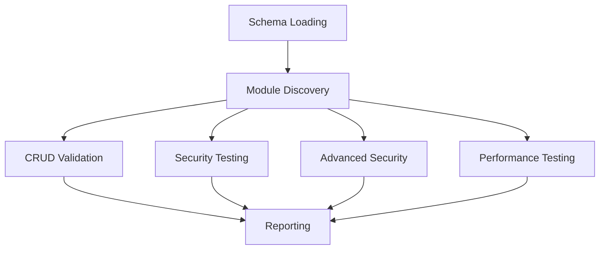

# 🧪 Enterprise API Testing Framework - Comprehensive Documentation

## 📋 Table of Contents
1. [Overview](#overview)
2. [Test Suite Architecture](#test-suite-architecture)
3. [Comprehensive Test Specifications](#comprehensive-test-specifications)
4. [Implementation Details](#implementation-details)
5. [Test Execution & Reporting](#test-execution--reporting)
6. [Best Practices](#best-practices)

## 🎯 Overview

This enterprise-grade API testing framework provides comprehensive validation for ERP system APIs across multiple testing dimensions. The framework automatically discovers and tests all available backend modules through recursive schema analysis.

### Key Features
- **🔍 Automatic Module Discovery** - Recursively scans schema to find all testable endpoints
- **🛡️ Multi-Dimensional Testing** - Security, Performance, CRUD, and Advanced Security testing
- **📊 Comprehensive Reporting** - Detailed Allure reports with metrics and analytics
- **⚡ Realistic Performance Testing** - Malicious load testing with realistic thresholds
- **🔒 Security-First Approach** - Comprehensive security validation across all endpoints

## 🏗️ Test Suite Architecture

### Test Suite Structure
```
tests/comprehensive-lifecycle/
├── 1.comprehensive-CRUD-Validation.test.js    # CRUD Lifecycle Operations
├── 2.comprehensive-API-Security.test.js       # Security Testing
├── 3.Advanced-Security-Testing.test.js        # Advanced Security Scenarios
└── 4.Performance-Malicious-Load.test.js       # Performance Under Load
```

### Test Execution Flow


## 📋 Comprehensive Test Specifications

### 1. 🎯 CRUD Lifecycle Validation Suite (`1.comprehensive-CRUD-Validation.test.js`)

**Objective**: Validate complete Create-Read-Update-Delete lifecycle operations across all ERP modules with dependency management and resilience testing.

#### Test Cases:

| TC# | Test Case | Objective | Expected Result | Implementation |
|-----|-----------|-----------|-----------------|----------------|
| **TC-1** | **CREATE Operation** | Test resource creation through POST endpoints | - HTTP 201/200 status<br>- Valid resource ID generation<br>- File persistence verification | `crudHelper.runCreateTest("Post")` |
| **TC-2** | **VIEW Operation** | Retrieve created resources through GET endpoints | - HTTP 200 status<br>- Resource data validation<br>- ID consistency check | `crudHelper.runViewTest("View")` |
| **TC-3** | **UPDATE Operation** | Modify existing resources through PUT endpoints | - HTTP 200/204 status<br>- Update confirmation<br>- Data integrity validation | `crudHelper.runUpdateTest("PUT")` |
| **TC-4** | **DELETE Operation** | Remove resources through DELETE endpoints | - HTTP 200/204 status<br>- Resource removal confirmation<br>- Cleanup verification | `crudHelper.runDeleteTest("DELETE")` |
| **TC-5** | **Negative VIEW** | Verify proper error handling for deleted resources | - HTTP 404/400 status<br>- Appropriate error messages<br>- Graceful degradation | `crudHelper.runNegativeViewTest("View")` |
| **TC-6** | **Resilience Testing** | Verify ID persistence across test executions | - File consistency<br>- Cross-test data integrity<br>- Recovery validation | `crudHelper.verifyFilePersistence()` |
| **TC-7** | **Configuration Validation** | Verify module configuration integrity | - Valid endpoint URLs<br>- Operation completeness<br>- Schema consistency | Configuration analysis |
| **TC-8** | **Multi-Module Analysis** | Verify schema compatibility across modules | - Module discovery validation<br>- Operation coverage analysis<br>- Cross-module consistency | Schema analysis |

**Key Implementation Features**:
```javascript
// Automatic module discovery and testing
const runCRUDTestsOnAllModules = (modules, parentPath = "") => {
  Object.entries(modules).forEach(([moduleName, moduleConfig]) => {
    // Recursively discover and test all modules with endpoints
    if (hasEndpoints) {
      describe(`CRUD Testing: ${fullModuleName}`, () => {
        // Individual CRUD test execution per module
      });
    }
  });
};
```

### 2. 🛡️ Comprehensive API Security Testing (`2.comprehensive-API-Security.test.js`)

**Objective**: Perform comprehensive security validation across all API endpoints including authorization, input validation, SQL injection, and XSS protection.

#### Test Cases:

| TC# | Test Case | Objective | Expected Result | Implementation |
|-----|-----------|-----------|-----------------|----------------|
| **TC-1** | **Authorization Security** | Validate unauthorized access rejection | - HTTP 401/403 for unauthorized requests<br>- Proper authentication enforcement | `TestHelpers.testAuthorizationSecurity()` |
| **TC-2** | **Malicious Payload Protection** | Test input validation against malicious data | - HTTP 400 for invalid payloads<br>- Request rejection with proper errors | `TestHelpers.testMaliciousPayloads()` |
| **TC-3** | **Null Field Validation** | Verify required field validation | - HTTP 400 for null required fields<br>- Clear validation error messages | `TestHelpers.testNullRequiredFields()` |
| **TC-4** | **Edit Validation** | Test update operation validation | - HTTP 400 for invalid updates<br>- Data integrity maintenance | `TestHelpers.testNullRequiredFields("PUT")` |
| **TC-5** | **SQL Injection Protection** | Validate SQL injection prevention | - Request rejection for SQL payloads<br>- No database errors exposed | `TestHelpers.testSQLInjectionProtection()` |
| **TC-6** | **XSS Protection** | Test Cross-Site Scripting prevention | - XSS payload sanitization<br>- Script injection prevention | `TestHelpers.testXSSProtection()` |
| **TC-7** | **Comprehensive Security Suite** | Run complete security validation | - All security controls functioning<br>- Defense-in-depth validation | `TestHelpers.runComprehensiveSecuritySuite()` |

**Key Implementation Features**:
```javascript
// Security test execution per module
test("[TC-1] Authorization Security - Reject Unauthorized Access", async () => {
  const authResults = await TestHelpers.testAuthorizationSecurity(moduleConfig);
  const failedAuthTests = authResults.filter(test => !test.success && !test.skipped);
  
  if (failedAuthTests.length > 0) {
    throw new Error(`Authorization security tests failed: ${errorMessages}`);
  }
});
```

### 3. 🔒 Advanced Security Testing (`3.Advanced-Security-Testing.test.js`)

**Objective**: Execute specialized advanced security scenarios including business logic flaws, privilege escalation, and complex attack patterns.

#### Test Cases:

| TC# | Test Case | Objective | Expected Result | Implementation |
|-----|-----------|-----------|-----------------|----------------|
| **TC-1** | **Advanced Security Scenarios** | Test complex security attack patterns | - Proper boundary validation<br>- Business logic protection<br>- Privilege enforcement | `TestHelpers.testAdvancedSecurityScenarios()` |
| **TC-2** | **Input Validation Chains** | Validate multi-stage input processing | - Sequential validation integrity<br>- Data sanitization throughout flow | Complex payload validation |
| **TC-3** | **Business Logic Security** | Test for business logic vulnerabilities | - Workflow integrity<br>- State transition security | Business rule validation |

**Key Implementation Features**:
```javascript
// Advanced security testing pattern
const runAdvancedSecurityOnAllModules = (modules, parentPath = "") => {
  Object.entries(modules).forEach(([moduleName, moduleConfig]) => {
    if (hasEndpoints) {
      test(`[AdvancedSecurity] should test advanced security scenarios for ${fullModuleName}`, async () => {
        const advancedSecurityResults = await TestHelpers.testAdvancedSecurityScenarios(
          moduleConfig, fullModuleName
        );
        
        if (advancedSecurityResults.failed && advancedSecurityResults.failed.length > 0) {
          throw new Error(`Advanced security tests failed for ${fullModuleName}`);
        }
      });
    }
  });
};
```

### 4. ⚡ Performance Under Malicious Load (`4.Performance-Malicious-Load.test.js`)

**Objective**: Validate system performance and resilience under concurrent malicious load conditions with realistic enterprise expectations.

#### Test Cases:

| TC# | Test Case | Objective | Expected Result | Implementation |
|-----|-----------|-----------|-----------------|----------------|
| **TC-1** | **Performance Under Load** | Test system performance with concurrent malicious requests | - Response times < 5s average<br>- Error rate < 20%<br>- Throughput maintenance | `TestHelpers.testPerformanceUnderMaliciousLoad()` |
| **TC-2** | **Error Handling Analysis** | Analyze error patterns under load conditions | - Graceful error responses<br>- No system crashes<br>- Proper logging | Error pattern analysis |
| **TC-3** | **Resource Utilization** | Monitor system resources during load | - Stable memory usage<br>- CPU utilization within limits<br>- No resource exhaustion | Resource monitoring |

**Key Implementation Features**:
```javascript
// Performance testing with realistic thresholds
const performanceResults = await TestHelpers.testPerformanceUnderMaliciousLoad(
  moduleConfig, fullModuleName
);

// Realistic enterprise performance expectations
const realisticThresholds = {
  maxAverageResponseTime: 5000,    // 5 seconds for enterprise systems
  maxErrorRate: 20,                // 20% error rate under malicious load
  maxP95ResponseTime: 8000,        // 8 seconds P95
  minSuccessRate: 80,              // 80% success rate under attack
};
```

## 🔧 Implementation Details

### Test Helper Functions (`utils/test-helpers.js`)

#### Core Test Methods:

```javascript
class TestHelpers {
  /**
   * Performance Testing Under Malicious Load
   * @param {Object} moduleConfig - Module configuration
   * @param {String} moduleName - Module identifier
   * @returns {Object} Performance metrics and results
   */
  static async testPerformanceUnderMaliciousLoad(moduleConfig, moduleName = "") {
    const performanceMetrics = {
      totalRequests: 0,
      successfulRequests: 0,
      failedRequests: 0,
      totalResponseTime: 0,
      responseTimes: [],
      errorRate: 0,
      throughput: 0,
      averageResponseTime: 0,
      p95ResponseTime: 0,
      p99ResponseTime: 0
    };
    
    // Implementation details...
    return {
      success: meetsPerformanceStandards,
      metrics: performanceMetrics,
      thresholds: performanceThresholds,
      meetsStandards: meetsPerformanceStandards,
      duration: totalDuration
    };
  }

  /**
   * Authorization Security Testing
   * @param {Object} moduleConfig - Module configuration
   * @returns {Array} Authorization test results
   */
  static async testAuthorizationSecurity(moduleConfig) {
    // Test unauthorized access, token validation, role-based access
    return authorizationResults;
  }

  /**
   * Malicious Payload Protection Testing
   * @param {Object} moduleConfig - Module configuration
   * @param {String} method - HTTP method to test
   * @param {String} moduleName - Module identifier
   * @returns {Array} Payload validation results
   */
  static async testMaliciousPayloads(moduleConfig, method, moduleName) {
    // Test various malicious payload types including:
    // - SQL injection attempts
    // - XSS payloads
    // - Buffer overflow attempts
    // - Path traversal attempts
    return payloadTestResults;
  }
}
```

### CRUD Lifecycle Helper (`tests/comprehensive-lifecycle/crud-lifecycle-helper.js`)

```javascript
class CrudLifecycleHelper {
  constructor(modulePath) {
    this.modulePath = modulePath;
    this.createdId = null;
  }

  /**
   * Execute CREATE operation test
   * @param {String} operationType - Operation type (Post, PUT, etc.)
   * @returns {Object} Creation results
   */
  async runCreateTest(operationType) {
    const testData = this.generateTestData();
    const response = await apiClient.makeRequest(
      this.getEndpoint(operationType),
      'POST',
      testData
    );
    
    this.createdId = this.extractResourceId(response);
    this.persistCreatedId();
    
    return {
      createdId: this.createdId,
      response: response,
      extractionDetails: this.extractionMethod
    };
  }

  /**
   * Execute VIEW operation test
   * @param {String} operationType - Operation type (View, GET, etc.)
   * @returns {Object} View results
   */
  async runViewTest(operationType) {
    this.enforcePrerequisite("createdId");
    
    const endpoint = this.getEndpoint(operationType).replace('{id}', this.createdId);
    const response = await apiClient.makeRequest(endpoint, 'GET');
    
    return { response };
  }
}
```

## 📊 Test Execution & Reporting

### Execution Commands

```bash
# Run specific test suites
npx jest tests/comprehensive-lifecycle/1.comprehensive-CRUD-Validation.test.js
npx jest tests/comprehensive-lifecycle/2.comprehensive-API-Security.test.js
npx jest tests/comprehensive-lifecycle/3.Advanced-Security-Testing.test.js
npx jest tests/comprehensive-lifecycle/4.Performance-Malicious-Load.test.js

# Run all comprehensive tests
npx jest tests/comprehensive-lifecycle/ --config=jest.config.js

# Run with Allure reporting
npx jest tests/comprehensive-lifecycle/ --config=jest.config.js --allure
```

### Reporting Structure

Each test suite generates comprehensive reports including:

1. **Executive Summary** - High-level test results and metrics
2. **Module-Level Details** - Individual module test results
3. **Performance Metrics** - Response times, throughput, error rates
4. **Security Findings** - Security test results and vulnerabilities
5. **Configuration Analysis** - Module configuration validation

### Sample Test Output

```javascript
// Test execution summary
{
  "execution": {
    "totalTests": 150,
    "passedTests": 142,
    "failedTests": 5,
    "skippedTests": 3,
    "duration": 125000
  },
  "modules": {
    "total": 45,
    "tested": 42,
    "passed": 40,
    "failed": 2
  },
  "security": {
    "authorization": 42,
    "maliciousPayloads": 42,
    "sqlInjection": 42,
    "xssProtection": 42
  }
}
```

## 🏆 Best Practices

### 1. Test Design Principles

- **✅ Single Responsibility**: Each test validates one specific aspect
- **✅ Independence**: Tests can run independently without dependencies
- **✅ Idempotency**: Tests can be run multiple times with same results
- **✅ Realistic Data**: Use realistic test data that mirrors production

### 2. Error Handling

```javascript
// Proper error handling in tests
try {
  const result = await apiClient.makeRequest(endpoint, method, payload);
  // Validate successful responses
} catch (error) {
  // Validate error responses are appropriate
  expect(error.response.status).toBeOneOf([400, 401, 403, 404]);
  global.attachJSON("Error Response Validation", {
    error: error.message,
    status: error.response.status,
    expected: true // In security testing, errors may be expected
  });
}
```

### 3. Performance Testing Guidelines

- **Realistic Load**: Use concurrent users and request patterns that mirror production
- **Meaningful Thresholds**: Set thresholds based on business requirements
- **Error Tolerance**: Allow for reasonable error rates under malicious conditions
- **Resource Monitoring**: Monitor system resources during performance tests

### 4. Security Testing Approach

- **Defense in Depth**: Test multiple layers of security controls
- **Positive & Negative Testing**: Test both valid and invalid scenarios
- **Boundary Testing**: Test edge cases and boundary conditions
- **Business Logic Security**: Validate business rule enforcement

## 🚀 Getting Started

### Prerequisites
- Node.js 16+
- Jest testing framework
- Allure reporting (optional)
- Access to target ERP API endpoints

### Setup
```bash
# Install dependencies
npm install

# Configure environment
cp .env.example .env
# Update .env with your API configuration

# Run tests
npm test
```

### Configuration
Update `constants.js` and environment variables to match your ERP system configuration, including:
- Base API URL
- Authentication tokens
- Module endpoints
- Performance thresholds
- Security test parameters

---

## 📞 Support

For questions or issues regarding this testing framework, please contact the QA team or refer to the internal documentation wiki.

**Last Updated**: November 2025  
**Version**: 2.0.0  
**Maintainer**: Enterprise QA Team